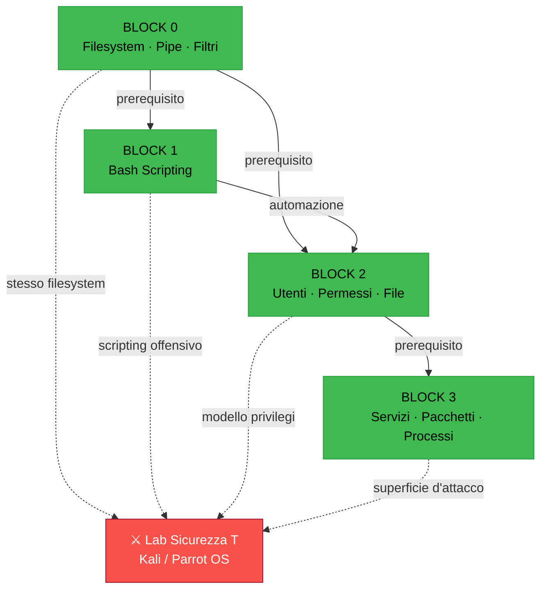
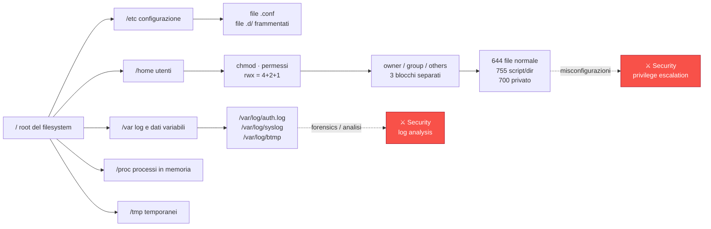
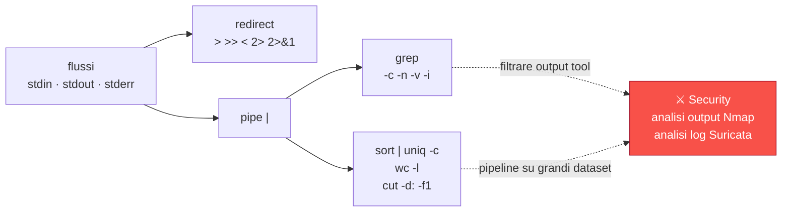
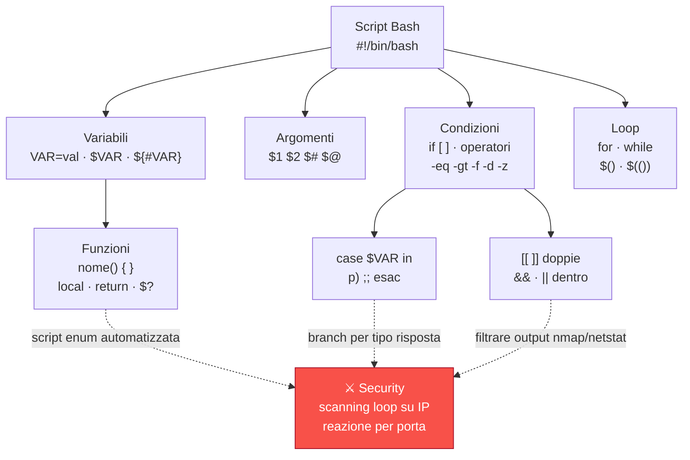
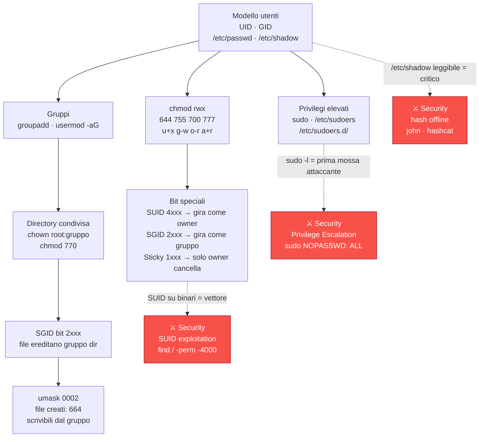
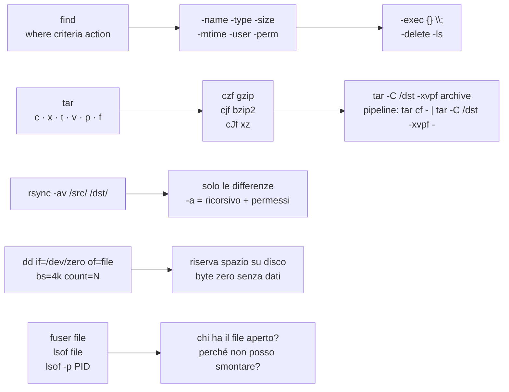
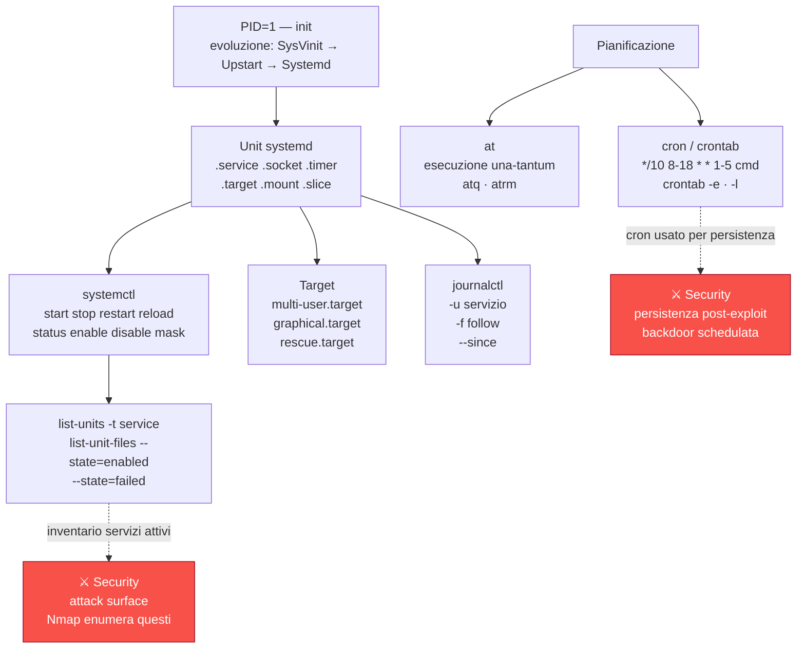
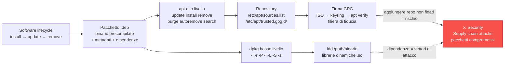

# Mappe Concettuali — Lab Amm. di Sistemi T

> **Come usare**:
> - **Obsidian**: apri questo file → i diagrammi vengono renderizzati inline
> - **VS Code**: estensione "Markdown Preview Mermaid Support" (gratuita)
> - **Screenshot → iPad**: apri in Obsidian, screenshot del diagramma per studio offline
>
> Colori: 🟢 concetti SysAdmin | 🔴 connessioni con Lab Sicurezza Informatica T

---

## Panoramica — Dipendenze tra Blocchi



---

## Block 0 — Fondamenta Linux

### 0A: Filesystem e Navigazione



### 0B: Pipe, Redirect e Filtri



---

## Block 1 — Bash Scripting



---

## Block 2 — Utenti, Permessi e File

### 2A/2B: Modello Utenti e Permessi



### 2C: Gestione File



---

## Block 3 — Servizi e Storage

### 3A: Systemd e Pianificazione



### 3B: Gestione Pacchetti



---

## Come aggiungere Wikilinks in Obsidian

Per attivare il **Graph View** in Obsidian, aggiungi nei tuoi appunti i link tra note:

```markdown
# Negli appunti di un modulo — esempio
Vedi [[glossario_sysadm#chmod]] per la sintassi ottale.
Connessione con [[concept_maps#block-2]] per il quadro d'insieme.
```

Ogni `[[collegamento]]` diventa un nodo nel grafo di Obsidian — senza spostare né riscrivere il contenuto esistente.
